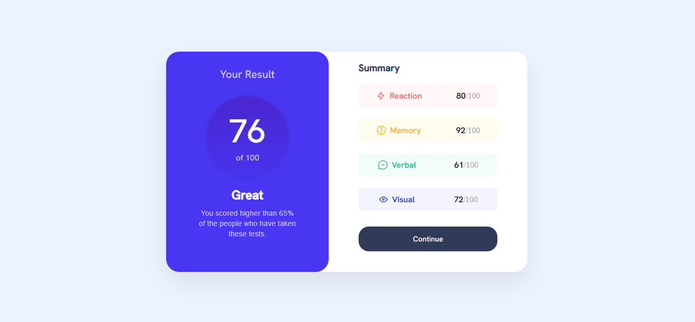

# Frontend Mentor - Results summary component

This is a solution to the [Results summary component on Frontend Mentor](https://www.frontendmentor.io/challenges/results-summary-component-CE_K6s0maV).  
Frontend Mentor challenges help you improve your coding skills by building realistic projects.

---

## 📸 Screenshot

---

## 🔗 Links

- **Solution URL:** [https://www.frontendmentor.io/challenges/results-summary-component-CE_K6s0maV?tab=report](#)
- **Live Site URL:** 

---

## 💻 My process

### Built with
- Semantic **HTML5** markup  
- **CSS3** (Flexbox, hover states, custom fonts)  
- Responsive design principles  

---

## 🧠 What I learned

While working on this project, I reinforced my understanding of:
- Using **semantic HTML** (`<main>`, `<section>`, `<ul>`)
- Creating **centered layouts** with Flexbox  
- Designing **consistent color palettes and hover effects**

Here’s a little code snippet I’m proud of:

.resultSection{
background-color: #4936f2;
border-radius: 25px;
width: 45%;
position: relative;
z-index: 2; 
padding-bottom: 40px;
}

button:hover{
background: linear-gradient(hsl(252, 100%, 67%), hsl(241, 81%, 54%));
transform: translateY(-3px);
}

  
  box-shadow: 0 8px 20px rgba(0,0,0,0.15);
}

